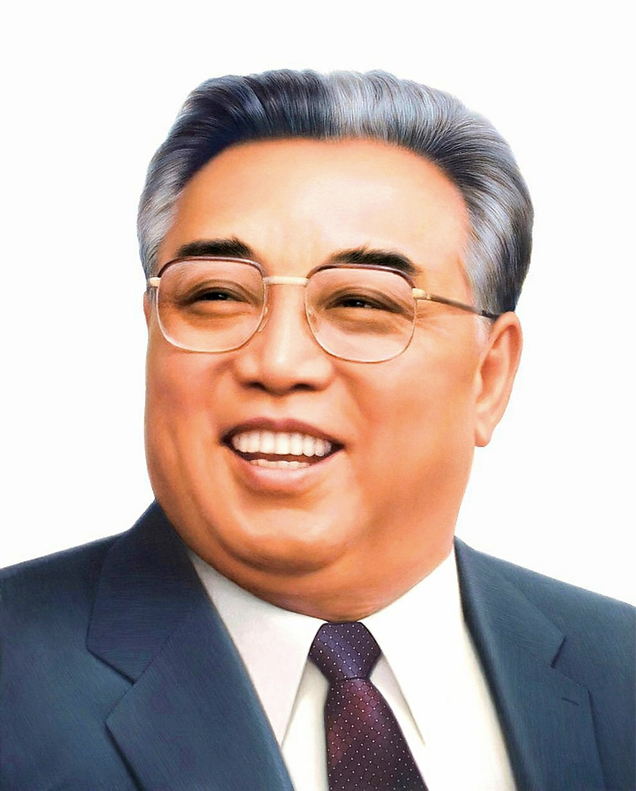
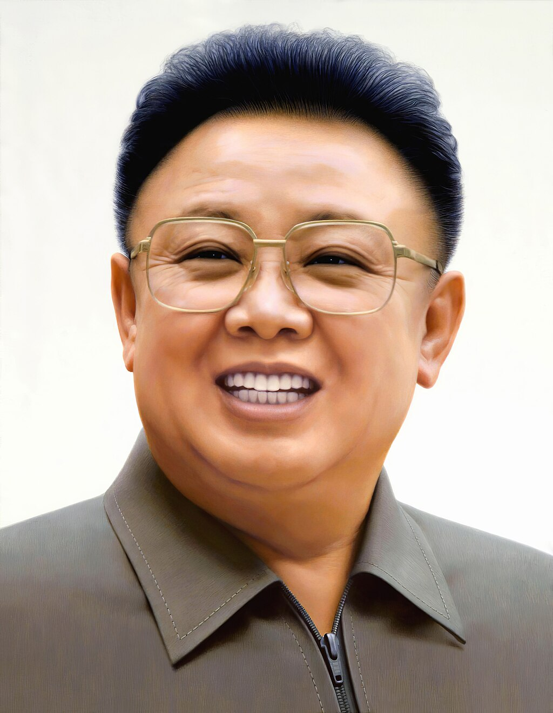

# 恩情音乐大赏
## 首领画像
伟大的首领 **金日成** 大元帅

伟大的领导者 **金正日** 大元帅

## 正文
曹县音乐，歌词内容虽不堪入目，但抛开内容不谈只用于调教人耳、提神醒脑的话则有奇效，笔者仅列举一二.

- 朝鲜人民军军歌（조선인민군가/朝鮮人民軍歌）

开头有一段强劲的小号.每一小节结束的合唱部分非常震撼人心.
**(注：不是郑律成的《朝鲜人民军进行曲》)**

- 攻击战（공격전이다／攻擊戰이다）

中文空耳部分非常洗脑.基本听个十几遍后就能模拟朝鲜语音节唱全歌.

- 千里马在奔驰（천리마 달린다／千里馬 달린다）

创作于上世纪60年代的老歌,当时曹县远比今日发达.歌词含金量很低、真正表现出了建成苏联式共产主义的愿景.歌曲节奏感强.
值得一提的是，相较于原版，现行版《千里马在奔驰》没有删除“共产主义”相关歌词（尽管共产主义、马克思主义已经从朝鲜宪法中剔除），但现行版歌词第一句为“团结在劳动党的旗帜下”，并非原版的“共产主义马上就要实现了”.

- 统一列车在奔驰（통일렬차 달린다/統一列車 走린다）

同样创作于上世纪六七十年代的、以南北朝鲜统一为题材的歌曲.带有浓郁的半岛民歌气息.

- 除了他我们谁都不认（우리는 당신밖에 모른다/우리는 當身밖에 모른다）

jb永动机.

- 亲切的父亲（친근한 어버이/親近한 어버이）

尽管歌词依然老套，但曲风非常现代化.

