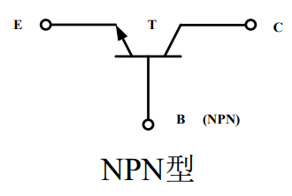
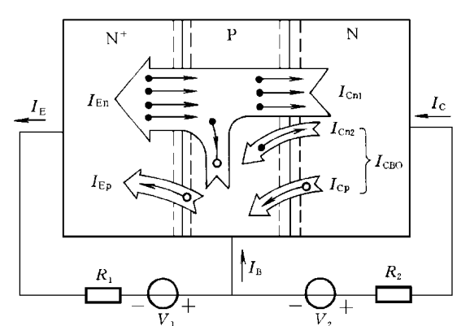
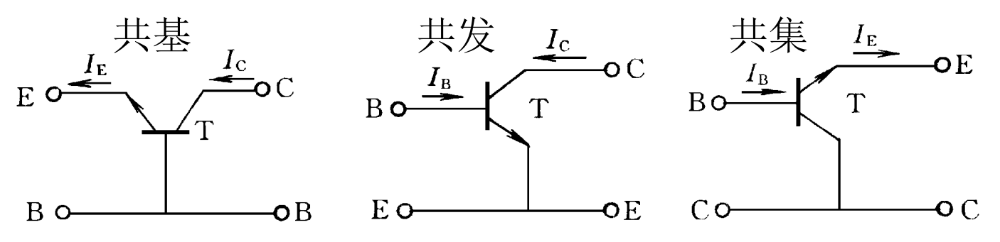

# 模电笔记第二周1-晶体三极管（甲）
三极管学名为**双极型晶体管**，分为NPN型和PNP型，三个电极引出线分别为发射极$E$、基极$B$和集电极$C$.
三极管有以下三种模式：
|模式|发射结|集电结|
|-|-|-|
|放大|正偏|反偏|
|饱和|正偏|正偏|
|截止|反偏|反偏|

三极管电路图符号（以NPN为例）：

## 三极管工作原理
### 载流子传输过程（以放大模式为例）

发射结加正偏后，阻挡层变窄，PN结两边多数载流子的扩散起主导作用 *（复习上周知识点）* .通过发射结的正向电流包括：

$I_{En}$:发射区自由电子前往基区形成的电流.

$I_{Ep}$:基区空穴前往发射区形成的电流.

由于三极管基区很窄，由发射区注入基区的自由电子在进入集电区边界时只有少量被空穴复合.而由基区注入发射区的空穴则大部分被复合.

---

集电结加反偏，阻挡层变宽，PN结两边少数载流子的漂移起主导作用.通过集电结的反向电流包括：

$I_{Cn1}$:发射区自由电子经由基区抵达集电结形成的电流.

$I_{Cn2}$:基区自由电子前往集电结形成的**反向饱和电流**.

$I_{Cp}$:集电区空穴前往基区形成的漂移电流.

发射区有两个任务：向基区注入电子、用电子复合基区注入的空穴，所以发射结电流$I_E=I_{En}+I_{Ep}$.

集电区也有两个任务：向基区注入空穴、用空穴复合基区注入的电子，所以集电区电流满足：

$$
I_C=I_{Cn1}+I_{Cn2}+I_{Cp}=I_{Cn1}+I_{CBO}
$$

$$
I_{CBO}=I_{Cn2}+I_{Cp}
$$

$I_{CBO}$是集电结本身的反向饱和电流，与发射区无关.

---

综合以上所有式子可得：

$$
\underline{I_E=I_C+I_B}
$$

一切工作在放大模式下的三极管都遵守上式.

### 关于载流子传输的讨论

在以上所有电流中，只有发射区出发的自由电子流能经由发射区、基区和集电区将$I_{En}$转化为$I_{Cn1}$，其大小只受发射极-基极PN结正偏电压的控制.其他电流均对三极管的正向受控毫无作用，属于三极管的 **寄生电流** .此时，引入参数$\overline{\alpha}$：

$$
\overline{\alpha}=\frac{I_{Cn1}}{I_E}=\frac{I_{En}}{I_E} \cdot \frac{I_{Cn1}}{I_{En}}=\eta_E \eta_B
$$

上式中，$\overline{\alpha}$是 **共基极电流传输系数** ，用于表示发射结电流转化为$I_{Cn1}$的能力.这一值一般在区间$\text{[0.98,1)}$内.

为了减小三极管寄生电流，制造晶体三极管需要以下条件：
- 发射结是不对称结，且发射区掺杂浓度远大于基区;
- 减小基区宽度;
- 集电区面积大于发射区;

## 共极时的电流传输方程

三极管是三端口元件，接入四端口网络时则必有一端作为输入/输出公共端.连接方式有共基极、共发射极和共集电极三种.

---

### 共基极

$$
I_C=I_{Cn1}+I_{CBO}=\overline{\alpha}I_E+I_{CBO}
$$

$$
一般地：I_{CBO}→0，所以\underline{I_C=\overline{\alpha}I_E}
$$

---

### 共发射极

$$
I_C=\frac{\overline{\alpha}}{1-\overline{\alpha}}I_B+\frac{1}{1-\overline{\alpha}}I_{CBO}
$$

$$
将\frac{\overline{\alpha}}{1-\overline{\alpha}}视为\overline{\beta}，所以\underline{I_E=\overline{\beta}I_B+I_{CEO}}
$$

仿照前述，$\overline{\beta}$被称为 **共发射极电流放大系数**,$I_{CEO}$被称为 **穿透电流** ，这是基极电流等于零时的集电极电流.

$$
由于I_{CEO}→0，所以I_E=\overline{\beta}I_B
$$

---

### 共集电极

由上文可知：$\underline{I_E≈(1+\overline{\beta})I_B}$

---

### 关于 $\overline \beta$ 的讨论

将$\overline \alpha$的定义代入$\overline \beta$可得：

$$
\overline \beta = \frac{I_C-I_{CBO}}{I_B+I_{CBO}}≈\frac{I_C}{I_B}
$$

可见：$\overline \beta$表征了基极电流对集电极电流的控制能力.

再讨论$I_{CEO}$，这是基极开路（$I_B=0$）时由集电极直通发射极的电流.经过上文公式推导可知：

$$
I_{CEO}=I_{CBO}+\overline \beta I_{CBO}=(1+\overline \beta)I_{CBO}
$$
