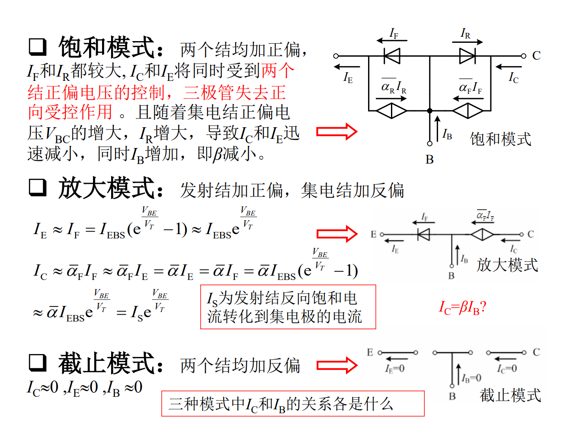

# 模电笔记第二周2-晶体三极管（乙）
## 用模型描述三极管的电路特性
只有将三极管用由受控源、理想二极管等基本电路元件组成的等效模型进行替代，才能准确计算含三极管电路的参数.
### 埃伯尔斯-莫尔模型
这是三极管的通用模型，适用于工作在任何模式下的三极管.详细模式和各端口电流传输方程可以参考下图：

注解：

$I_F$：流过发射结二极管的电流.在NPN管中以流出发射结为正方向，故以F(Forward)记之;

$I_R$：流过集电结二极管的电流.与正方向相反，故以R(Reverse)记之;

$I_{EBS}$：集电结短路（$V_{BC}=0$）时发射结的反向饱和电流;

$I_{CBS}$：发射结短路（$V_{BE}=0$）时集电结的反向饱和电流.

**显然地，埃伯尔斯-莫尔模型虽然较精确，但较为繁琐，并不适合手工计算.**

（埃伯尔斯-莫尔模型在放大模式和截止模式下的第一次简化仍然十分繁琐，无法用于应试计算，在此仅作展示）

### 共射等效模型

将埃伯尔斯-莫尔模型继续简化，可得到共发射极条件下的等效模型。

#### 共射大信号模型

用于在分析直流状态下三极管工作状况的模型.

*（有点不想写了，毕竟工作量过大，且张雷老师的ppt还是比较全面的()）*